命名的颜色
===========

snow

_________________________________
ghost white

_________________________________
GhostWhite

_________________________________
white smoke

.. image:: ../images/named_colors/white smoke.png
    :scale: 60 %
_________________________________
WhiteSmoke

_________________________________
gainsboro

_________________________________
floral white

_________________________________
FloralWhite

_________________________________
old lace

_________________________________
OldLace

.. image:: ../images/named_colors/OldLace.png
    :scale: 60 %
_________________________________
linen

_________________________________
antique white

_________________________________
AntiqueWhite

_________________________________
papaya whip

.. image:: ../images/named_colors/papaya whip.png
    :scale: 60 %
_________________________________
PapayaWhip

_________________________________
blanched almond

_________________________________
BlanchedAlmond

_________________________________
bisque

_________________________________
peach puff

_________________________________
PeachPuff

_________________________________
navajo white

_________________________________
NavajoWhite

_________________________________
moccasin

_________________________________
cornsilk

_________________________________
ivory

_________________________________
lemon chiffon

_________________________________
LemonChiffon

_________________________________
seashell

_________________________________
honeydew

_________________________________
mint cream

.. image:: ../images/named_colors/mint cream.png
    :scale: 60 %
_________________________________
MintCream

_________________________________
azure

_________________________________
alice blue

.. image:: ../images/named_colors/alice blue.png
    :scale: 60 %
_________________________________
AliceBlue

_________________________________
lavender

_________________________________
lavender blush

.. image:: ../images/named_colors/lavender blush.png
    :scale: 60 %
_________________________________
LavenderBlush

_________________________________
misty rose

.. image:: ../images/named_colors/misty rose.png
    :scale: 60 %
_________________________________
MistyRose

.. image:: ../images/named_colors/MistyRose.png
    :scale: 60 %
_________________________________
white

_________________________________
black

_________________________________
dark slate gray

.. image:: ../images/named_colors/dark slate gray.png
    :scale: 60 %
_________________________________
DarkSlateGray

_________________________________
dark slate grey

.. image:: ../images/named_colors/dark slate grey.png
    :scale: 60 %
_________________________________
DarkSlateGrey

_________________________________
dim gray

.. image:: ../images/named_colors/dim gray.png
    :scale: 60 %
_________________________________
DimGray

_________________________________
dim grey

.. image:: ../images/named_colors/dim grey.png
    :scale: 60 %
_________________________________
DimGrey

_________________________________
slate gray

.. image:: ../images/named_colors/slate gray.png
    :scale: 60 %
_________________________________
SlateGray

_________________________________
slate grey

.. image:: ../images/named_colors/slate grey.png
    :scale: 60 %
_________________________________
SlateGrey

_________________________________
light slate gray

_________________________________
LightSlateGray

_________________________________
light slate grey

.. image:: ../images/named_colors/light slate grey.png
    :scale: 60 %
_________________________________
LightSlateGrey

_________________________________
gray

_________________________________
grey

_________________________________
light grey

.. image:: ../images/named_colors/light grey.png
    :scale: 60 %
_________________________________
LightGrey

_________________________________
light gray

_________________________________
LightGray

_________________________________
midnight blue

.. image:: ../images/named_colors/midnight blue.png
    :scale: 60 %
_________________________________
MidnightBlue

_________________________________
navy

_________________________________
navy blue

.. image:: ../images/named_colors/navy blue.png
    :scale: 60 %
_________________________________
NavyBlue

_________________________________
cornflower blue

.. image:: ../images/named_colors/cornflower blue.png
    :scale: 60 %
_________________________________
CornflowerBlue

_________________________________
dark slate blue

.. image:: ../images/named_colors/dark slate blue.png
    :scale: 60 %
_________________________________
DarkSlateBlue

_________________________________
slate blue

_________________________________
SlateBlue

_________________________________
medium slate blue

.. image:: ../images/named_colors/medium slate blue.png
    :scale: 60 %
_________________________________
MediumSlateBlue

_________________________________
light slate blue

.. image:: ../images/named_colors/light slate blue.png
    :scale: 60 %
_________________________________
LightSlateBlue

_________________________________
medium blue

_________________________________
MediumBlue

_________________________________
royal blue

.. image:: ../images/named_colors/royal blue.png
    :scale: 60 %
_________________________________
RoyalBlue

_________________________________
blue

_________________________________
dodger blue

.. image:: ../images/named_colors/dodger blue.png
    :scale: 60 %
_________________________________
DodgerBlue

_________________________________
deep sky blue

.. image:: ../images/named_colors/deep sky blue.png
    :scale: 60 %
_________________________________
DeepSkyBlue

_________________________________
sky blue

.. image:: ../images/named_colors/sky blue.png
    :scale: 60 %
_________________________________
SkyBlue

.. image:: ../images/named_colors/SkyBlue.png
    :scale: 60 %
_________________________________
light sky blue

.. image:: ../images/named_colors/light sky blue.png
    :scale: 60 %
_________________________________
LightSkyBlue

_________________________________
steel blue

_________________________________
SteelBlue

_________________________________
light steel blue

.. image:: ../images/named_colors/light steel blue.png
    :scale: 60 %
_________________________________
LightSteelBlue

_________________________________
light blue

_________________________________
LightBlue

_________________________________
powder blue

.. image:: ../images/named_colors/powder blue.png
    :scale: 60 %
_________________________________
PowderBlue

_________________________________
pale turquoise

.. image:: ../images/named_colors/pale turquoise.png
    :scale: 60 %
_________________________________
PaleTurquoise

_________________________________
dark turquoise

_________________________________
DarkTurquoise

_________________________________
medium turquoise

.. image:: ../images/named_colors/medium turquoise.png
    :scale: 60 %
_________________________________
MediumTurquoise

_________________________________
turquoise

_________________________________
cyan

_________________________________
light cyan

.. image:: ../images/named_colors/light cyan.png
    :scale: 60 %
_________________________________
LightCyan

_________________________________
cadet blue

.. image:: ../images/named_colors/cadet blue.png
    :scale: 60 %
_________________________________
CadetBlue

_________________________________
medium aquamarine

.. image:: ../images/named_colors/medium aquamarine.png
    :scale: 60 %
_________________________________
MediumAquamarine

_________________________________
aquamarine

_________________________________
dark green

.. image:: ../images/named_colors/dark green.png
    :scale: 60 %
_________________________________
DarkGreen

_________________________________
dark olive green

_________________________________
DarkOliveGreen

_________________________________
dark sea green

.. image:: ../images/named_colors/dark sea green.png
    :scale: 60 %
_________________________________
DarkSeaGreen

_________________________________
sea green

_________________________________
SeaGreen

_________________________________
medium sea green

.. image:: ../images/named_colors/medium sea green.png
    :scale: 60 %
_________________________________
MediumSeaGreen

_________________________________
light sea green

_________________________________
LightSeaGreen

_________________________________
pale green

.. image:: ../images/named_colors/pale green.png
    :scale: 60 %
_________________________________
PaleGreen

_________________________________
spring green

.. image:: ../images/named_colors/spring green.png
    :scale: 60 %
_________________________________
SpringGreen

_________________________________
lawn green

.. image:: ../images/named_colors/lawn green.png
    :scale: 60 %
_________________________________
LawnGreen

_________________________________
green

_________________________________
chartreuse

_________________________________
medium spring green

.. image:: ../images/named_colors/medium spring green.png
    :scale: 60 %
_________________________________
MediumSpringGreen

_________________________________
green yellow

.. image:: ../images/named_colors/green yellow.png
    :scale: 60 %
_________________________________
GreenYellow

_________________________________
lime green

.. image:: ../images/named_colors/lime green.png
    :scale: 60 %
_________________________________
LimeGreen

_________________________________
yellow green

.. image:: ../images/named_colors/yellow green.png
    :scale: 60 %
_________________________________
YellowGreen

_________________________________
forest green

.. image:: ../images/named_colors/forest green.png
    :scale: 60 %
_________________________________
ForestGreen

_________________________________
olive drab

.. image:: ../images/named_colors/olive drab.png
    :scale: 60 %
_________________________________
OliveDrab

_________________________________
dark khaki

.. image:: ../images/named_colors/dark khaki.png
    :scale: 60 %
_________________________________
DarkKhaki

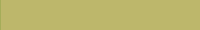
_________________________________
khaki

_________________________________
pale goldenrod

_________________________________
PaleGoldenrod

_________________________________
light goldenrod yellow

.. image:: ../images/named_colors/light goldenrod yellow.png
    :scale: 60 %
_________________________________
LightGoldenrodYellow

_________________________________
light yellow

.. image:: ../images/named_colors/light yellow.png
    :scale: 60 %
_________________________________
LightYellow

_________________________________
yellow

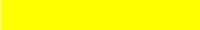
_________________________________
gold

.. image:: ../images/named_colors/gold.png
    :scale: 60 %
_________________________________
light goldenrod

.. image:: ../images/named_colors/light goldenrod.png
    :scale: 60 %
_________________________________
LightGoldenrod

_________________________________
goldenrod

_________________________________
dark goldenrod

.. image:: ../images/named_colors/dark goldenrod.png
    :scale: 60 %
_________________________________
DarkGoldenrod

_________________________________
rosy brown

.. image:: ../images/named_colors/rosy brown.png
    :scale: 60 %
_________________________________
RosyBrown

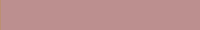
_________________________________
indian red

.. image:: ../images/named_colors/indian red.png
    :scale: 60 %
_________________________________
IndianRed

_________________________________
saddle brown

.. image:: ../images/named_colors/saddle brown.png
    :scale: 60 %
_________________________________
SaddleBrown

_________________________________
sienna

_________________________________
peru

_________________________________
burlywood

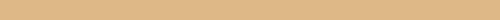
_________________________________
beige

_________________________________
wheat

_________________________________
sandy brown

.. image:: ../images/named_colors/sandy brown.png
    :scale: 60 %
_________________________________
SandyBrown

_________________________________
tan

_________________________________
chocolate

_________________________________
firebrick

_________________________________
brown

_________________________________
dark salmon

_________________________________
DarkSalmon

_________________________________
salmon

_________________________________
light salmon

.. image:: ../images/named_colors/light salmon.png
    :scale: 60 %
_________________________________
LightSalmon

_________________________________
orange

_________________________________
dark orange

.. image:: ../images/named_colors/dark orange.png
    :scale: 60 %
_________________________________
DarkOrange

_________________________________
coral

_________________________________
light coral

.. image:: ../images/named_colors/light coral.png
    :scale: 60 %
_________________________________
LightCoral

_________________________________
tomato

_________________________________
orange red

.. image:: ../images/named_colors/orange red.png
    :scale: 60 %
_________________________________
OrangeRed

_________________________________
red

_________________________________
hot pink

.. image:: ../images/named_colors/hot pink.png
    :scale: 60 %
_________________________________
HotPink

_________________________________
deep pink

.. image:: ../images/named_colors/deep pink.png
    :scale: 60 %
_________________________________
DeepPink

_________________________________
pink

_________________________________
light pink

.. image:: ../images/named_colors/light pink.png
    :scale: 60 %
_________________________________
LightPink

_________________________________
pale violet red

.. image:: ../images/named_colors/pale violet red.png
    :scale: 60 %
_________________________________
PaleVioletRed

_________________________________
maroon

_________________________________
medium violet red

.. image:: ../images/named_colors/medium violet red.png
    :scale: 60 %
_________________________________
MediumVioletRed

_________________________________
violet red

.. image:: ../images/named_colors/violet red.png
    :scale: 60 %
_________________________________
VioletRed

_________________________________
magenta

_________________________________
violet

_________________________________
plum

_________________________________
orchid

.. image:: ../images/named_colors/orchid.png
    :scale: 60 %
_________________________________
medium orchid

.. image:: ../images/named_colors/medium orchid.png
    :scale: 60 %
_________________________________
MediumOrchid

_________________________________
dark orchid

.. image:: ../images/named_colors/dark orchid.png
    :scale: 60 %
_________________________________
DarkOrchid

_________________________________
dark violet

.. image:: ../images/named_colors/dark violet.png
    :scale: 60 %
_________________________________
DarkViolet

.. image:: ../images/named_colors/DarkViolet.png
    :scale: 60 %
_________________________________
blue violet

.. image:: ../images/named_colors/blue violet.png
    :scale: 60 %
_________________________________
BlueViolet

_________________________________
purple

_________________________________
medium purple

.. image:: ../images/named_colors/medium purple.png
    :scale: 60 %
_________________________________
MediumPurple

_________________________________
thistle

_________________________________
snow1

_________________________________
snow2

_________________________________
snow3

_________________________________
snow4

_________________________________
seashell1

_________________________________
seashell2

_________________________________
seashell3

_________________________________
seashell4

_________________________________
AntiqueWhite1

_________________________________
AntiqueWhite2

_________________________________
AntiqueWhite3

_________________________________
AntiqueWhite4

_________________________________
bisque1

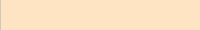
_________________________________
bisque2

_________________________________
bisque3

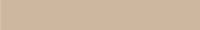
_________________________________
bisque4

_________________________________
PeachPuff1

_________________________________
PeachPuff2

_________________________________
PeachPuff3

_________________________________
PeachPuff4

_________________________________
NavajoWhite1

_________________________________
NavajoWhite2

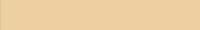
_________________________________
NavajoWhite3

_________________________________
NavajoWhite4

_________________________________
LemonChiffon1

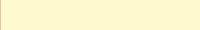
_________________________________
LemonChiffon2

.. image:: ../images/named_colors/LemonChiffon2.png
    :scale: 60 %
_________________________________
LemonChiffon3

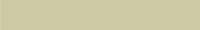
_________________________________
LemonChiffon4

_________________________________
cornsilk1

_________________________________
cornsilk2

_________________________________
cornsilk3

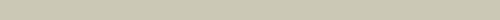
_________________________________
cornsilk4

_________________________________
ivory1

_________________________________
ivory2

_________________________________
ivory3

_________________________________
ivory4

_________________________________
honeydew1

_________________________________
honeydew2

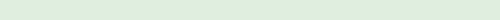
_________________________________
honeydew3

_________________________________
honeydew4

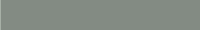
_________________________________
LavenderBlush1

_________________________________
LavenderBlush2

_________________________________
LavenderBlush3

_________________________________
LavenderBlush4

_________________________________
MistyRose1

_________________________________
MistyRose2

_________________________________
MistyRose3

_________________________________
MistyRose4

_________________________________
azure1

_________________________________
azure2

_________________________________
azure3

_________________________________
azure4

_________________________________
SlateBlue1

_________________________________
SlateBlue2

_________________________________
SlateBlue3

_________________________________
SlateBlue4

_________________________________
RoyalBlue1

_________________________________
RoyalBlue2

_________________________________
RoyalBlue3

_________________________________
RoyalBlue4

_________________________________
blue1

_________________________________
blue2

_________________________________
blue3

_________________________________
blue4

_________________________________
DodgerBlue1

_________________________________
DodgerBlue2

_________________________________
DodgerBlue3

_________________________________
DodgerBlue4

_________________________________
SteelBlue1

_________________________________
SteelBlue2

_________________________________
SteelBlue3

_________________________________
SteelBlue4

_________________________________
DeepSkyBlue1

_________________________________
DeepSkyBlue2

_________________________________
DeepSkyBlue3

.. image:: ../images/named_colors/DeepSkyBlue3.png
    :scale: 60 %
_________________________________
DeepSkyBlue4

_________________________________
SkyBlue1

_________________________________
SkyBlue2

_________________________________
SkyBlue3

_________________________________
SkyBlue4

_________________________________
LightSkyBlue1

_________________________________
LightSkyBlue2

_________________________________
LightSkyBlue3

_________________________________
LightSkyBlue4

_________________________________
SlateGray1

_________________________________
SlateGray2

_________________________________
SlateGray3

_________________________________
SlateGray4

_________________________________
LightSteelBlue1

_________________________________
LightSteelBlue2

_________________________________
LightSteelBlue3

_________________________________
LightSteelBlue4

_________________________________
LightBlue1

_________________________________
LightBlue2

_________________________________
LightBlue3

_________________________________
LightBlue4

_________________________________
LightCyan1

_________________________________
LightCyan2

_________________________________
LightCyan3

.. image:: ../images/named_colors/LightCyan3.png
    :scale: 60 %
_________________________________
LightCyan4

_________________________________
PaleTurquoise1

.. image:: ../images/named_colors/PaleTurquoise1.png
    :scale: 60 %
_________________________________
PaleTurquoise2

_________________________________
PaleTurquoise3

_________________________________
PaleTurquoise4

_________________________________
CadetBlue1

_________________________________
CadetBlue2

_________________________________
CadetBlue3

_________________________________
CadetBlue4

_________________________________
turquoise1

_________________________________
turquoise2

_________________________________
turquoise3

.. image:: ../images/named_colors/turquoise3.png
    :scale: 60 %
_________________________________
turquoise4

_________________________________
cyan1

_________________________________
cyan2

_________________________________
cyan3

_________________________________
cyan4

_________________________________
DarkSlateGray1

_________________________________
DarkSlateGray2

_________________________________
DarkSlateGray3

_________________________________
DarkSlateGray4

_________________________________
aquamarine1

.. image:: ../images/named_colors/aquamarine1.png
    :scale: 60 %
_________________________________
aquamarine2

_________________________________
aquamarine3

_________________________________
aquamarine4

_________________________________
DarkSeaGreen1

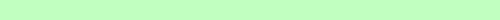
_________________________________
DarkSeaGreen2

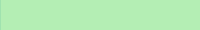
_________________________________
DarkSeaGreen3

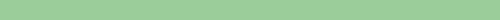
_________________________________
DarkSeaGreen4

_________________________________
SeaGreen1

_________________________________
SeaGreen2

_________________________________
SeaGreen3

_________________________________
SeaGreen4

_________________________________
PaleGreen1

_________________________________
PaleGreen2

.. image:: ../images/named_colors/PaleGreen2.png
    :scale: 60 %
_________________________________
PaleGreen3

_________________________________
PaleGreen4

_________________________________
SpringGreen1

_________________________________
SpringGreen2

_________________________________
SpringGreen3

_________________________________
SpringGreen4

_________________________________
green1

_________________________________
green2

_________________________________
green3

_________________________________
green4

_________________________________
chartreuse1

_________________________________
chartreuse2

_________________________________
chartreuse3

_________________________________
chartreuse4

_________________________________
OliveDrab1

_________________________________
OliveDrab2

_________________________________
OliveDrab3

_________________________________
OliveDrab4

_________________________________
DarkOliveGreen1

_________________________________
DarkOliveGreen2

.. image:: ../images/named_colors/DarkOliveGreen2.png
    :scale: 60 %
_________________________________
DarkOliveGreen3

.. image:: ../images/named_colors/DarkOliveGreen3.png
    :scale: 60 %
_________________________________
DarkOliveGreen4

_________________________________
khaki1

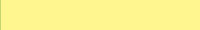
_________________________________
khaki2

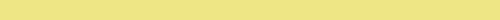
_________________________________
khaki3

_________________________________
khaki4

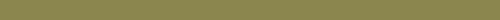
_________________________________
LightGoldenrod1

_________________________________
LightGoldenrod2

_________________________________
LightGoldenrod3

_________________________________
LightGoldenrod4

_________________________________
LightYellow1

_________________________________
LightYellow2

_________________________________
LightYellow3

_________________________________
LightYellow4

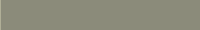
_________________________________
yellow1

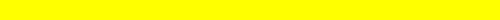
_________________________________
yellow2

_________________________________
yellow3

_________________________________
yellow4

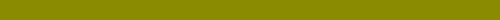
_________________________________
gold1

_________________________________
gold2

_________________________________
gold3

_________________________________
gold4

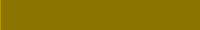
_________________________________
goldenrod1

_________________________________
goldenrod2

_________________________________
goldenrod3

_________________________________
goldenrod4

_________________________________
DarkGoldenrod1

_________________________________
DarkGoldenrod2

_________________________________
DarkGoldenrod3

_________________________________
DarkGoldenrod4

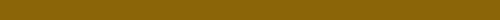
_________________________________
RosyBrown1

_________________________________
RosyBrown2

_________________________________
RosyBrown3

_________________________________
RosyBrown4

_________________________________
IndianRed1

_________________________________
IndianRed2

_________________________________
IndianRed3

_________________________________
IndianRed4

_________________________________
sienna1

_________________________________
sienna2

_________________________________
sienna3

_________________________________
sienna4

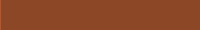
_________________________________
burlywood1

_________________________________
burlywood2

_________________________________
burlywood3

_________________________________
burlywood4

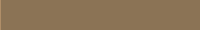
_________________________________
wheat1

_________________________________
wheat2

_________________________________
wheat3

_________________________________
wheat4

.. image:: ../images/named_colors/wheat4.png
    :scale: 60 %
_________________________________
tan1

_________________________________
tan2

_________________________________
tan3

_________________________________
tan4

.. image:: ../images/named_colors/tan4.png
    :scale: 60 %
_________________________________
chocolate1

_________________________________
chocolate2

_________________________________
chocolate3

_________________________________
chocolate4

_________________________________
firebrick1

_________________________________
firebrick2

_________________________________
firebrick3

_________________________________
firebrick4

_________________________________
brown1

_________________________________
brown2

_________________________________
brown3

.. image:: ../images/named_colors/brown3.png
    :scale: 60 %
_________________________________
brown4

_________________________________
salmon1

_________________________________
salmon2

_________________________________
salmon3

_________________________________
salmon4

_________________________________
LightSalmon1

_________________________________
LightSalmon2

.. image:: ../images/named_colors/LightSalmon2.png
    :scale: 60 %
_________________________________
LightSalmon3

_________________________________
LightSalmon4

_________________________________
orange1

_________________________________
orange2

_________________________________
orange3

_________________________________
orange4

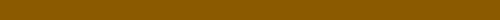
_________________________________
DarkOrange1

_________________________________
DarkOrange2

_________________________________
DarkOrange3

_________________________________
DarkOrange4

_________________________________
coral1

_________________________________
coral2

_________________________________
coral3

_________________________________
coral4

_________________________________
tomato1

_________________________________
tomato2

_________________________________
tomato3

_________________________________
tomato4

_________________________________
OrangeRed1

_________________________________
OrangeRed2

_________________________________
OrangeRed3

_________________________________
OrangeRed4

_________________________________
red1

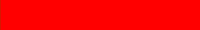
_________________________________
red2

_________________________________
red3

_________________________________
red4

_________________________________
DeepPink1

_________________________________
DeepPink2

_________________________________
DeepPink3

_________________________________
DeepPink4

_________________________________
HotPink1

_________________________________
HotPink2

.. image:: ../images/named_colors/HotPink2.png
    :scale: 60 %
_________________________________
HotPink3

_________________________________
HotPink4

_________________________________
pink1

_________________________________
pink2

_________________________________
pink3

_________________________________
pink4

_________________________________
LightPink1

_________________________________
LightPink2

_________________________________
LightPink3

_________________________________
LightPink4

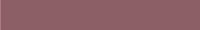
_________________________________
PaleVioletRed1

_________________________________
PaleVioletRed2

_________________________________
PaleVioletRed3

_________________________________
PaleVioletRed4

_________________________________
maroon1

_________________________________
maroon2

_________________________________
maroon3

_________________________________
maroon4

_________________________________
VioletRed1

_________________________________
VioletRed2

_________________________________
VioletRed3

_________________________________
VioletRed4

_________________________________
magenta1

_________________________________
magenta2

_________________________________
magenta3

_________________________________
magenta4

_________________________________
orchid1

_________________________________
orchid2

_________________________________
orchid3

_________________________________
orchid4

_________________________________
plum1

_________________________________
plum2

_________________________________
plum3

_________________________________
plum4

_________________________________
MediumOrchid1

_________________________________
MediumOrchid2

_________________________________
MediumOrchid3

_________________________________
MediumOrchid4

_________________________________
DarkOrchid1

_________________________________
DarkOrchid2

_________________________________
DarkOrchid3

_________________________________
DarkOrchid4

_________________________________
purple1

_________________________________
purple2

_________________________________
purple3

_________________________________
purple4

_________________________________
MediumPurple1

_________________________________
MediumPurple2

_________________________________
MediumPurple3

_________________________________
MediumPurple4

_________________________________
thistle1

_________________________________
thistle2

_________________________________
thistle3

_________________________________
thistle4

_________________________________
gray0

.. image:: ../images/named_colors/gray0.png
    :scale: 60 %
_________________________________
grey0

_________________________________
gray1

_________________________________
grey1

_________________________________
gray2

_________________________________
grey2

_________________________________
gray3

_________________________________
grey3

_________________________________
gray4

_________________________________
grey4

_________________________________
gray5

_________________________________
grey5

_________________________________
gray6

_________________________________
grey6

_________________________________
gray7

_________________________________
grey7

_________________________________
gray8

_________________________________
grey8

_________________________________
gray9

_________________________________
grey9

_________________________________
gray10

_________________________________
grey10

_________________________________
gray11

_________________________________
grey11

_________________________________
gray12

_________________________________
grey12

_________________________________
gray13

_________________________________
grey13

_________________________________
gray14

_________________________________
grey14

_________________________________
gray15

_________________________________
grey15

.. image:: ../images/named_colors/grey15.png
    :scale: 60 %
_________________________________
gray16

_________________________________
grey16

_________________________________
gray17

_________________________________
grey17

_________________________________
gray18

_________________________________
grey18

_________________________________
gray19

_________________________________
grey19

_________________________________
gray20

_________________________________
grey20

_________________________________
gray21

_________________________________
grey21

_________________________________
gray22

_________________________________
grey22

_________________________________
gray23

_________________________________
grey23

_________________________________
gray24

_________________________________
grey24

_________________________________
gray25

_________________________________
grey25

_________________________________
gray26

_________________________________
grey26

.. image:: ../images/named_colors/grey26.png
    :scale: 60 %
_________________________________
gray27

_________________________________
grey27

_________________________________
gray28

_________________________________
grey28

_________________________________
gray29

_________________________________
grey29

_________________________________
gray30

_________________________________
grey30

_________________________________
gray31

_________________________________
grey31

_________________________________
gray32

_________________________________
grey32

_________________________________
gray33

_________________________________
grey33

_________________________________
gray34

_________________________________
grey34

.. image:: ../images/named_colors/grey34.png
    :scale: 60 %
_________________________________
gray35

_________________________________
grey35

_________________________________
gray36

_________________________________
grey36

_________________________________
gray37

_________________________________
grey37

_________________________________
gray38

_________________________________
grey38

_________________________________
gray39

_________________________________
grey39

_________________________________
gray40

_________________________________
grey40

_________________________________
gray41

_________________________________
grey41

_________________________________
gray42

_________________________________
grey42

_________________________________
gray43

_________________________________
grey43

_________________________________
gray44

_________________________________
grey44

.. image:: ../images/named_colors/grey44.png
    :scale: 60 %
_________________________________
gray45

_________________________________
grey45

_________________________________
gray46

_________________________________
grey46

_________________________________
gray47

_________________________________
grey47

_________________________________
gray48

_________________________________
grey48

_________________________________
gray49

_________________________________
grey49

_________________________________
gray50

_________________________________
grey50

_________________________________
gray51

_________________________________
grey51

_________________________________
gray52

_________________________________
grey52

_________________________________
gray53

_________________________________
grey53

_________________________________
gray54

_________________________________
grey54

_________________________________
gray55

_________________________________
grey55

_________________________________
gray56

_________________________________
grey56

_________________________________
gray57

_________________________________
grey57

_________________________________
gray58

_________________________________
grey58

_________________________________
gray59

_________________________________
grey59

_________________________________
gray60

_________________________________
grey60

_________________________________
gray61

_________________________________
grey61

_________________________________
gray62

_________________________________
grey62

_________________________________
gray63

_________________________________
grey63

_________________________________
gray64

_________________________________
grey64

_________________________________
gray65

_________________________________
grey65

.. image:: ../images/named_colors/grey65.png
    :scale: 60 %
_________________________________
gray66

_________________________________
grey66

_________________________________
gray67

_________________________________
grey67

_________________________________
gray68

_________________________________
grey68

_________________________________
gray69

_________________________________
grey69

_________________________________
gray70

.. image:: ../images/named_colors/gray70.png
    :scale: 60 %
_________________________________
grey70

_________________________________
gray71

_________________________________
grey71

_________________________________
gray72

_________________________________
grey72

_________________________________
gray73

_________________________________
grey73

_________________________________
gray74

_________________________________
grey74

_________________________________
gray75

_________________________________
grey75

_________________________________
gray76

_________________________________
grey76

_________________________________
gray77

_________________________________
grey77

_________________________________
gray78

_________________________________
grey78

_________________________________
gray79

_________________________________
grey79

_________________________________
gray80

.. image:: ../images/named_colors/gray80.png
    :scale: 60 %
_________________________________
grey80

_________________________________
gray81

_________________________________
grey81

_________________________________
gray82

_________________________________
grey82

_________________________________
gray83

_________________________________
grey83

_________________________________
gray84

_________________________________
grey84

_________________________________
gray85

_________________________________
grey85

.. image:: ../images/named_colors/grey85.png
    :scale: 60 %
_________________________________
gray86

_________________________________
grey86

_________________________________
gray87

_________________________________
grey87

.. image:: ../images/named_colors/grey87.png
    :scale: 60 %
_________________________________
gray88

_________________________________
grey88

_________________________________
gray89

_________________________________
grey89

_________________________________
gray90

_________________________________
grey90

_________________________________
gray91

.. image:: ../images/named_colors/gray91.png
    :scale: 60 %
_________________________________
grey91

_________________________________
gray92

_________________________________
grey92

_________________________________
gray93

_________________________________
grey93

.. image:: ../images/named_colors/grey93.png
    :scale: 60 %
_________________________________
gray94

_________________________________
grey94

.. image:: ../images/named_colors/grey94.png
    :scale: 60 %
_________________________________
gray95

_________________________________
grey95

_________________________________
gray96

_________________________________
grey96

_________________________________
gray97

_________________________________
grey97

_________________________________
gray98

_________________________________
grey98

_________________________________
gray99

_________________________________
grey99

_________________________________
gray100

_________________________________
grey100

.. image:: ../images/named_colors/grey100.png
    :scale: 60 %
_________________________________
dark grey

.. image:: ../images/named_colors/dark grey.png
    :scale: 60 %
_________________________________
DarkGrey

.. image:: ../images/named_colors/DarkGrey.png
    :scale: 60 %
_________________________________
dark gray

.. image:: ../images/named_colors/dark gray.png
    :scale: 60 %
_________________________________
DarkGray

_________________________________
dark blue

.. image:: ../images/named_colors/dark blue.png
    :scale: 60 %
_________________________________
DarkBlue

_________________________________
dark cyan

.. image:: ../images/named_colors/dark cyan.png
    :scale: 60 %
_________________________________
DarkCyan

_________________________________
dark magenta

.. image:: ../images/named_colors/dark magenta.png
    :scale: 60 %
_________________________________
DarkMagenta

_________________________________
dark red

.. image:: ../images/named_colors/dark red.png
    :scale: 60 %
_________________________________
DarkRed

_________________________________
light green

.. image:: ../images/named_colors/light green.png
    :scale: 60 %
_________________________________
LightGreen

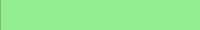
_________________________________
