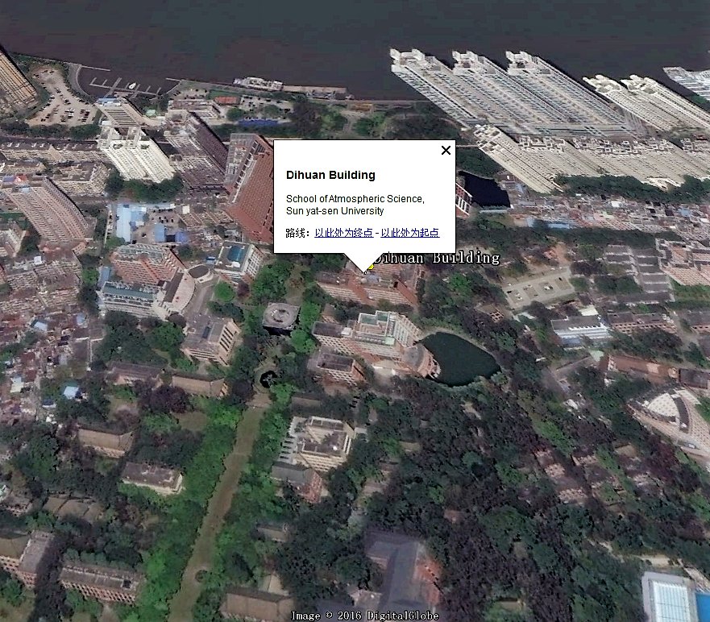

对KML的支持
============

*本文作者* ：`keenmisty <https://github.com/keenmisty>`_ 

简介
------------

KML(Keyhold Markup Language)是一种XML语法格式的标记语言，可以在多种应用程序中显示，包括 Google Earth、Google Map、ArcGIS(ArcMap/ArcGlobe)等，驴友们制作路书的时候也经常采用这种格式制作。

它的优势是可以把几何、符号系统、描述、属性、影像和行为等数据封装到单个源中，非常方便数据的共享和在线展示。

NCL对于KML的支持起自2013年，由Mohammad Abouali开发，他制作了一个名为 `NCL_GETools <http://www.ncl.ucar.edu/Document/Manuals/GETools/NCL_GETools.html>`_ 的NCL输出库，使得NCL可以将各种气象模型结果输出成KML格式，从而可以方便的在各类GIS软件中与其他地理信息数据一起进行处理，或是通过Google Earth/Map的API进行在线的展示。

.. note:: NCL_GETools需要6.2.0之后版本的NCL。

使用
------------

首先，需要在你自己的ncl脚本中声明调用这一工具：

.. code:: sh

    load "$NCARG_ROOT/lib/ncarg/nclscripts/contrib/NCL_GETools.ncl"

然后即可在你个人的ncl脚本中调用以下函数或者过程，来完成相应的动作：

* 函数

  - get_coordinate_system_string
  - GetAltModeNumber
  - read_ict
  - squeeze
  - get_KML_IconHref
  - ones
  - zeros
  - dim_dimsizes
  - Gray2RGBA
  - Gray2cIndex
  - ToHex
  - add_KML_ColorMapStyles

* 过程

  - add_KML_Description
  - add_KML_Address
  - add_KML_Range
  - add_KML_Name
  - add_KML_Coordinates
  - add_KML_Width
  - add_KML_Open
  - add_KML_FlyToView
  - add_KML_Extrude
  - add_KML_Visibility
  - add_KML_Tessellate
  - add_KML_Fill
  - add_KML_Outline
  - add_KML_Altitude
  - add_KML_AltMode
  - add_KML_Color
  - add_KML_North
  - add_KML_South
  - add_KML_East
  - add_KML_West
  - add_KML_Rotation
  - add_KML_StyleUrl
  - add_KML_HideChildrenStyle
  - hide_KML_Children
  - add_KML_Href
  - add_KML_Icon
  - add_KML_Heading
  - add_KML_TimeSpan
  - add_KML_TimeStamp_When
  - add_KML_LineStyle
  - add_KML_IconStyle
  - add_KML_PolyStyle
  - add_KML_LineString
  - add_KML_LatLonBox
  - add_KML_LinearRing
  - add_KML_OuterBoundaryIs
  - add_KML_InnerBoundaryIs
  - add_KML_GOverlay
  - add_KML_Polygon
  - add_KML_nSidedPolygon
  - add_KML_Point
  - Open_KML_MultiGeometry
  - Close_KML_MultiGeometry
  - Open_KML_Link
  - Close_KML_Link
  - Open_KML_NetworkLink
  - Close_KML_NetworkLink
  - Open_KML_Folder
  - Close_KML_Folder
  - Open_KML_Placemark
  - Close_KML_Placemark
  - Open_KML_Style
  - Close_KML_Style
  - Open_KML_Document
  - Close_KML_Document
  - OpenKML
  - CloseKML
  - RasterTimeSeries2KML
  - SHP2KML
  - Point2KML
  - Velocity2KML
  - Points2KML
  - Collect_KMLs
  - Path2KML
  - Measurements2KML
  - UnstructGrid2KML
  - UnstructData2KML
  - UnstructVelocity2KML

例子
------------

* Point2KML的使用

新增一个文件名为`1.ncl`的脚本，内容如下：

.. code:: sh
    load "$NCARG_ROOT/lib/ncarg/nclscripts/contrib/NCL_GETools.ncl"
      begin
      
        Opt=True
        Opt@Name="Dihuan Building"
        Opt@Lat=23.103685
        Opt@Lon=113.294506
        Opt@Description="School of Atmospheric Science, Sun yat-sen University"
        Opt@Verbose=True

        kml_FileName="sysu_sas_building"
        Point2KML(kml_FileName, Opt)
      end

执行这个ncl，即可得到一个名为`sysu_sas_building.kml`的文件，把它放入GoogleEarth中，即可看到如下的样子(当然，首先要能加载出来GE中的地球，否则需要首先翻下墙)：

其他值得注意的事情
------------

* Ryan Pavlick制作了一个更深入的ncl制作kml的库，`link <https://github.com/rpavlick/kmlncl>`_
* 更推荐使用ArcGIS等地理信息系统工具处理kml文件

.. image:: ../images/donate/donate.png
    :scale: 40 %
    :align: center
    :target: http://ncl.readthedocs.io/zh_CN/latest/donater.html#keenmisty

评论
----------

.. disqus::
    :disqus_identifier: KML

