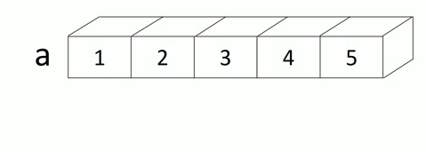

NCL数组
=========================
数组是NCL中贯穿始终的概念，也是NCL代码高效工作的基础。一些从Fortran转过来的学习
者可能需要暂时放下循环思维，重新理解NCL的数组思维对于提高编写的代码质量是至关重
要的。

定义数组
--------------------------
大体上，有三种方式可以创建NCL数组，分别的数组的直接定义、new语句（注意不是函数）
和其他数组创建函数。

直接定义
^^^^^^^^^^^^^^^^^^
数组创建以数组定义符 :code:`(/` 和 :code:`/)` 封闭所有元素，元素之间以逗号
:code:`,` 进行分隔。多维数组创建通过嵌套数组定义符即可。数组元素既可以包含标
量值，也可以包括其他数组。数组可以被建立为任何的基本类型以及图形对象。当前文
件数组（包含文件变量的数组）并不被支持。数组中以逗号分隔的每一个元素必须和其
它元素有相同的大小。另外，如果数组元素彼此类型不同时，类型转换规则将被应用，
将数组元素转换为同一类型，如果类型转换失败，NCL将抛出异常。

下面是几个直接定义数组范例::

    (/1, 2, 3, 4, 5/)  ; 创建一维整型数组
    (/ (/1, 2, 3/)^2, (/4, 5, 6/)^3, (/7, 8, 9/)^4/) ; 创建3*3的二维整型数组
    (/ a - b, b + c,  c/d /)  ; 以变量创建数组

需要注意的一点是，如果将变量置于数组定义符  :code:`(/` 和 :code:`/)`
内，只有变量的值会被引用，而与变量相关的元数据（后面会细述），包括属性、维和
坐标都将丢失。

new语句
^^^^^^^^^^^^^^^^^^^
相比于直接定义，在某些情况下，比如我想创建一个高维数组，并且将所有的值初始化
为0，那么可能就要用到new语句了。new语句使用起来有点像Fortran的带大小的数组变
量声明,但是new语句被执行后就会开辟内存空间。

new语句包含的参数：

1. 维数大小，可以是数组或标量
2. 类型，任意数据类型，可用引号括起类型关键词，但常直接使用关键词
3. 缺测值，可选参数，无缺测也可使用 :code:`No_FillValue` ，省略时使用类型默认

几个范例::

    a = new( (/ 5, 6, 7 /), float)  ; 创建一个5*6*7大小的三维浮点型数组
    b = new( (/ 5, 6, 7 /), short, -999)  ; 设置默认缺测为-999
    c = new( (/ 5, 6, 7 /), integer, "No_FillValue")  ; 设定没有缺测值

实用技巧
    在我们定义一个数组的大小和类型的时候，我们常常会参考到其他变量。比如我想
    创建与某个变量同样维数、大小的数组，怎么操作呢？其实搭配一些函数，如 
    :code:`dimsizes` 或者 :code:`typeof` , :code:`new` 语句将会好用的多。

    .. code::

        m = new((/5,6,7/), integer, -999)
        n = new(dimsizes(m), string)  ; 搭配dimsizes函数可以定义同样大小的数组
        p = new(10, typeof(n))  ; 使用typeof函数就可以定义与n同样类型的数组变量
        q = new(10, typeof(n), m@_FillValue)  ; 使用第三个参数则可定义同样缺测值的数组变量
        x = n  ; 可能直接用另一个变量赋值是最有效的方式

.. note:: 需要认真声明一点，尽管使用起来很像，但new并不是一个函数，而是NCL语句，这意味在new语句中可以直接使用NCL关键词，比如graphic、string， 而不需要使用引号。

其他数组创建函数
^^^^^^^^^^^^^^^^^^^^^^^^^
有许多其他方式也可以创建数组，下面简单介绍几种常用的。

计算中常常面临的一种情况是创建等差序列，NCL中包含两个函数可以用来处理这种情况，
分别是 :code:`ispan` 和 :code:`fspan` 。

:code:`ispan` 创建根据初值、终值和步长来创建等差整数序列
:code:`ispan(start, finish, stride)` 
例::

    x = ispan(1, 10, 1)  ; 即 (/1, 2, 3, 4 ,5, 6, 7, 8, 9, 10/)
    y = ispan(10, 1, 1)  ; 即 (/10, 9, 8, 7, 6, 5, 4, 3, 2, 1/)

.. note:: 降序的步长并不是负数哦。

| :code:`fspan` 通过初值、终值和序列元素总的个数创建浮点数等差序列
| :code:`fspan(start, finish, npts)`
| 例::

    x = fspan(0, 359.5, 720)  ; 即 (/0, 0.5, 1, 1.5, 2, ..., 358, 368.5, 359, 359.5/)
    y = fspan(359.5, 0, 720)  ; 即 (/359.5, 359, 368.5, 358, ..., 2, 1.5, 1, 0.5, 0/)

________________________________________________________________________________

数组索引和切片
-------------------
数组索引和切片是最基本的提取数组元素的操作，方式也多种多样。

| **索引指的是提取数组中某个特定位置的值**
| **切片指的是提取数组中一个连续或不连续片段**

索引
^^^^^^^^^^^
语法
    :code:`a(index)` , 使用圆括号将索引括起来，序号从 :code:`0` 开始，根据不同维数的数组，索引可以是一个或多个逗号隔开的 **整数**

例::

    a = (/1, 2, 3, 4, 5/)
    b = (/(/1,2,3,4,5/), (/4,5,6,7,8/), (/7,8,9,10,11/)/)
    print(a(3))  ; 提取a数组序号为3的（第4个）元素，即为4
    print(b(0, 1)) ; 提取b数组序号为第0行、第1列的元素， 即为2
    print(b(1, 3)) ; 提取b数组序号为第1行、第3列的元素， 即为7

.. image:: images/array/index2.gif
