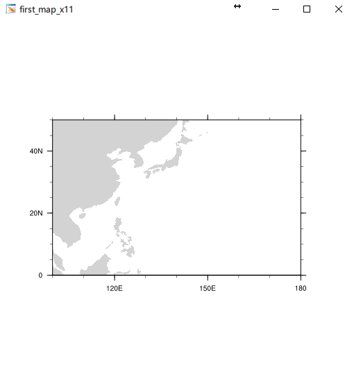

.. highlight:: ncl
   :linenothreshold: 5

绘制你的第一张地图
=====================

多数NCL初学者，在接触NCL前对NCL的印象限于绘图语言。为了保持学习的趣味性，教程也
首先从NCL绘制一张地图开始，学习NCL的基本编程风格。

载入函数库
----------------
NCL中除去标准库外，绘图的的函数库是专门的，需要在使用前先载入到命名空间。
NCL中有两类绘图函数，一类是gsn函数，另一类是gsn_csm函数，gsn_csm函数是在gsn函数上
风格化定制的高级接口，通常来说我们更愿意选择gsn_csm函数来绘图图形。

使用 :code:`load` 关键词来载入NCL函数库的语法如下

.. code::

    load "$NCARG_ROOT/lib/ncarg/nclscripts/csm/gsn_code.ncl"
    load "$NCARG_ROOT/lib/ncarg/nclscripts/csm/gsn_csm.ncl"
    load "$NCARG_ROOT/lib/ncarg/nclscripts/csm/contributed.ncl"

.. note:: NCL 6.2.0版本开始自动地载入了以上的三个常用库文件，因此除非你想让自己的代码也能在较旧的NCL版本上成功执行，一般地，你并不需要再载入这三个库了。

________________________________________________________________________________

开始一个代码块
----------------
NCL使用 :code:`begin` 和 :code:`end` 关键词来封装一段代码，这不是必须的，你大可
不写 :code:`begin` 和 :code:`end`。使用它们的好处在于被其封装的代码块被执行前首
先会进行语法检查，并及时抛出异常。这可以让你较早发现代码错误，而不是在执行到错误
时才了解到代码的语法问题。

.. code::

    begin
.. note:: 为了让代码可读性变得更好，我建议对代码块代码进行同级缩进。

________________________________________________________________________________

打开绘图工作台
----------------
绘图工作台指的是一个图形文件或X11窗口，这就好比我们使用绘图软件PhotoShop绘图前需
要创建一个画板。使用 :code:`gsn_open_wks` 函数来打开一个工作台，其使用方法是，

.. code::

    wks = gsn_open_wks(type, filename)

其中\ *type*\ 接受一个字符串参数作为工作台的类型，如"X11"， "png"， "eps"等等。
而\ *filename*\ 接受一个字符串参数作为工作台的标题或者文件名。

________________________________________________________________________________

定义源变量和属性
------------------
通常绘图函数使用一个布尔型变量来控制输出图形的细节，这个布尔型变量被称作\ **源变量**\ 
（resources），当源变量赋值为NCL逻辑真时，可以给源变量赋予各种属性来调整图形的各个
细节。给变量赋予属性使用 :code:`@` 标点。NCL中有着纷繁复杂的源变量属性，这对于新手来说
简直就是一个灾难，因为在开始时，你很难了解每个源变量属性的含义。但是如果你搞清楚
了NCL源变量属性的命名规则，相信能给你带来很大的帮助。

.. code::

    res = True  ; 定义源变量，赋值为真
    res@mpMinLonF = 100.  ; 定义源变量的mpMinLonF属性，赋值为100.
    res@mpMaxLonF = 180.
    res@mpMinLatF = 0.
    res@mpMaxLatF = 50.

在以上的代码中，我们给源变量赋予了四个属性，它们分别控制地图的起始和结束的经度、
纬度。属性中的 :code:`mp` 代表了这个属性控制地图，而最后的 :code:`F` 代表了这个
属性的类型是浮点数。

________________________________________________________________________________

使用绘图函数绘制空白地图
--------------------------
NCL中有许多的绘图函数来绘制不同类型的图，包括非地图类和地图类等。比如当你需要绘制
等值线时，你需要使用的绘图函数名中必须有contour，而绘制风场箭头时，则是vector。
所有的绘图函数可以查阅官网，`传送门 <https://www.ncl.ucar.edu/Document/Functions/graphics_routines.shtml>`_。

在这里，我们使用一个最常用的地图绘图函数 :code:`gsn_csm_map_ce` 来绘制一张
Cylindrical equidistant (ce后缀) 投影的空白地图。

.. code::

    plot = gsn_csm_map_ce(wks, res)

| 这个绘图函数接受两个参数，
| 第一个参数是控制台变量，代表了这个地图图层将被增加到wks工作台中
| 第二个参数是源变量，代表了用res这个源变量来控制这个地图图层的细节。

________________________________________________________________________________

结束一个代码块
----------------
.. code::

    end

通过以上的几句代码，你就绘制了一张东半球大平洋地区的地图。你可以随意更改四个源变
量属性的值将地图缩放到不同大小的地区。当然，如果是全球的话，你大可以直接将
:code:`plot = gsn_csm_map_ce(wks, res)` 改写为
:code:`plot = gsn_csm_map_ce(wks, False)`
注意这里我们之间将图形函数的第二参数，也就是源变量的值设置为 :code:`False` 了，
这代表使用函数 :code:`gsn_csm_map_ce` 默认的图形属性设置。

以下代码可复制到NCL命令行中测试

.. code::

    begin
        wks = gsn_open_wks("X11", "first_map")
        res = True
        res@mpMinLonF = 100.
        res@mpMaxLonF = 180.
        res@mpMinLatF = 0.
        res@mpMaxLatF = 50.
        plot = gsn_csm_map_ce(wks, res)
    end

生成的图形

